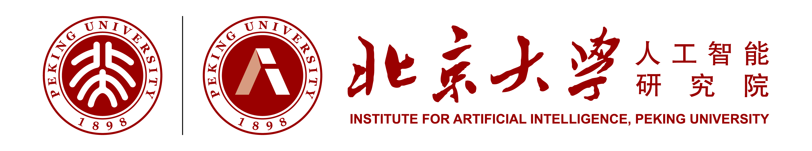

---
redirect_from:
  - home/
  - cive60008_21/
  - cive60008_21/week01/seminar1/
  - cive60008_22/
  - cive60008_22/assignments/1/
  - cive60008_22/assignments/2/
  - cive60008_22/week01/notebooks/
  - cive60008_22/week02/notebooks/
  - cive60008_22/week03/notebooks/
  - cive60008_22/week04/notebooks/
  - cive60008_22/week05/notebooks/
  - cive60008_22/week06/notebooks/
  - cive60008_22/week07/notebooks/
  - cive60008_22/week08/notebooks/
  - cive60008_22/week09/notebooks/
  - cive97129_23/assignments/1/
  - cive97129_23/assignments/2/
  - demo-pathfinding/
  - project/shift-project/
  - research/autonomy/
  - research/logistics/
  - tags/
  - tag/autonomy
  - teaching/
  - tf/
  - tf/60008_21/
  - wsds/
---

The **Brain-Inspired Laboratory** at **Peking University** focuses on brain-inspired computing,spiking neural networks ,computational neuroscience and ai4science.
Our group is led by [**Prof Tiejun Huang**](/members/tiejun-huang), and is affiliated with the **College of Artificial Intelligence**.



#### Our work




#### Our news







#### Our priorities





#### Our publications







Our laboratory is an academic community rooted in **freedom and inclusivity**, driven by **unity and innovation**. From the spark of inspiration to scientific breakthroughs, we always stand side by side.

Backed by first-class research capabilities, we delve into cutting-edge fields, equipped with top-tier experimental facilities and academic resources to provide a solid foundation for exploring the unknown. Leveraging extensive social connections and international cooperation networks, we break down geographical and disciplinary boundaries, enabling students to deeply participate in transnational research projects, engage with world-leading scholars, and grasp the pulse of academic frontiers from a global perspective.

<!-- Regardless of your background or academic aspirations, we welcome you with an equal and open attitude. Here, your **potential will be unlocked**, and your **talents will be cherished**—let us jointly write our own chapter of innovation in the vast ocean of scientific research. -->

If you are interested, please feel free to contact us and join this academic journey!













#### Our funders













